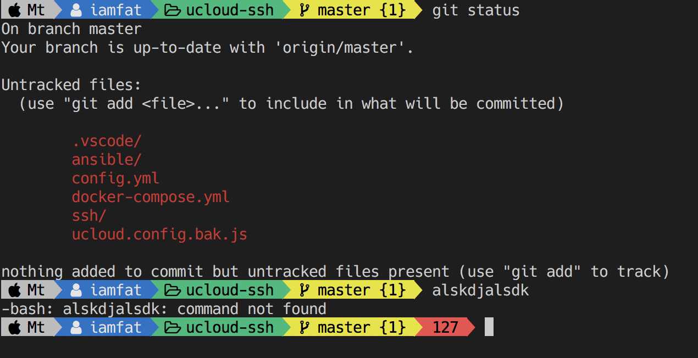

# oh-my-genee-theme
A theme for oh-my-bash based on builtin powerline theme,  with nerd font required. I tested in my macOS env.

> BTW, 相对于oh-my-zsh, oh-my-bash其实是个buggy货色, 不过习惯了bash..就不换了

## Screenshot


## Requirements
1. `bash`
2. `homebrew`

## How to Use it?
1. install latest bash to `/usr/local/bin/bash`.
```bash
brew install bash
```
2. make sure your default shell is bash 4+ instead of built-in one.
```bash
echo '/usr/local/bin/bash' | sudo tee -a /etc/shells
sudo chsh -s /usr/local/bin/bash $USER
```
3. install `oh-my-bash` from `https://ohmybash.github.io`.
```bash
sh -c "$(curl -fsSL https://raw.github.com/ohmybash/oh-my-bash/master/tools/install.sh)"
```
4. install this theme.
```bash
git clone https://github.com/iamfat/oh-my-genee-theme $HOME/.oh-my-bash/custom/themes/genee
```
4. install nerd font.
```bash
brew tap caskroom/fonts
brew cask install font-hack-nerd-font
```
5. update `.bashrc` to load genee theme.
```bash
sed -i 's/^OSH_THEME=.*$/OSH_THEME="genee"/' $HOME/.bashrc
```

